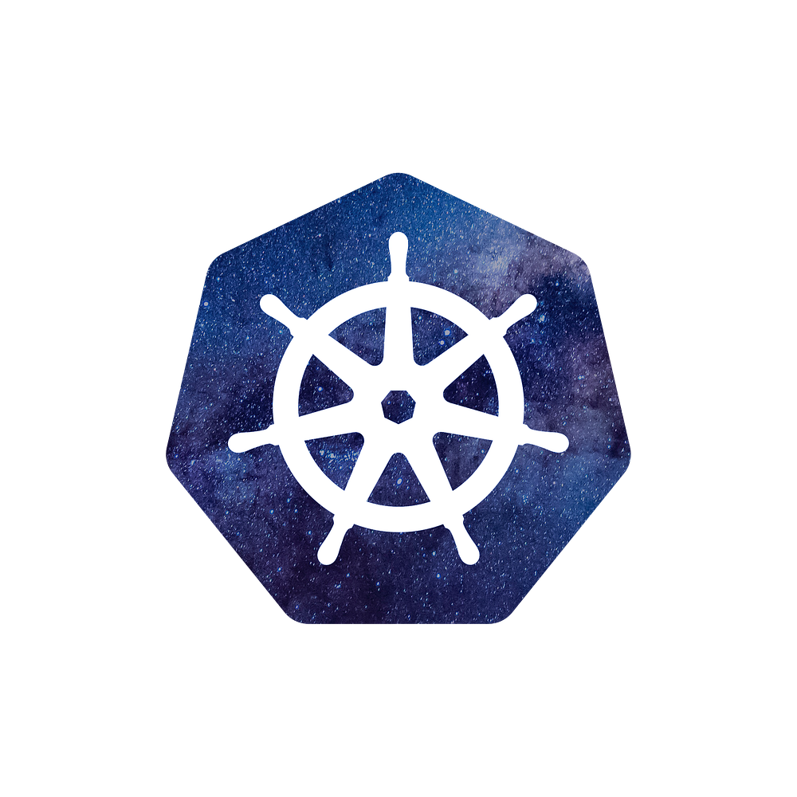

<p align="center">
  
</p>

<h1 align="center">KubeDeck</h1>
<p align="center">A native macOS Kubernetes navigator — browse clusters, namespaces, and resources with a built-in terminal.</p>

<p align="center">
  <a href="https://github.com/swapnil-saal/kube-navigator/releases/latest">
    
  </a>
  
  
  
</p>

---

## Download

> **macOS Apple Silicon (arm64) — requires macOS 13+**

👉 **[Download the latest .dmg from Releases](https://github.com/swapnil-saal/kube-navigator/releases/latest)**

1. Download `KubeDeck-1.0.0-arm64.dmg`
2. Open the DMG and drag **KubeDeck** to your Applications folder
3. Right-click → **Open** on first launch (bypasses Gatekeeper for unsigned builds)

---

## Features

| Feature | Description |
|---|---|
| 🌐 **Multi-cluster** | Switch between all contexts in your `~/.kube/config` |
| 📦 **All resource types** | Pods, Deployments, Services, ConfigMaps, Secrets, Ingresses, StatefulSets, DaemonSets, Jobs, CronJobs, ReplicaSets, PersistentVolumeClaims, and Nodes |
| 🔍 **Resource detail** | Full YAML view, metadata, labels, annotations, and status |
| 📋 **Pod logs** | Stream live logs directly from any pod container |
| 💻 **Built-in terminal** | Full xterm.js terminal running your default shell |
| 🌙 **Dark / Light theme** | System-aware theme with manual toggle |
| ⚡ **Fast** | Electron + Vite + React, no cloud dependency — everything runs locally |

---

## Screenshots

> The app pulls real data from your local kubeconfig — no screenshots included to avoid leaking cluster info.

---

## Requirements

- macOS 13+ (Apple Silicon / arm64)
- `kubectl` installed and available in your PATH (e.g. via Homebrew: `brew install kubectl`)
- A valid `~/.kube/config` with at least one context

KubeDeck reads your full shell environment (including `KUBECONFIG` set in `.zshrc` / `.bashrc`) automatically.

---

## Tech Stack

- **Electron 40** — native desktop shell
- **React 18 + Vite** — frontend
- **Express 5** — local API server (bundled inside the app)
- **xterm.js** — terminal emulator
- **Tailwind CSS + shadcn/ui** — UI components
- **kubectl CLI** — all K8s operations (shell out, no SDK dependency)

---

## Development

### Prerequisites

```bash
brew install node kubectl
```

### Setup

```bash
git clone https://github.com/swapnil-saal/kube-navigator.git
cd kube-navigator
npm install
```

### Run in dev mode

```bash
npm run electron:dev
```

This builds the Vite frontend + Express server bundle and launches Electron.

### Build DMG (macOS)

```bash
npm run electron:build:mac
# Output: release/KubeDeck-1.0.0-arm64.dmg
```

> The build runs a deep ad-hoc re-sign (`codesign --deep --force --sign -`) after packaging to satisfy macOS 26.x Team ID enforcement.

---

## Project Structure

```
├── client/          # React frontend (Vite)
│   └── src/
│       ├── pages/   # Dashboard, ResourceDetail
│       └── components/
├── server/          # Express API server
│   └── routes.ts    # kubectl-backed REST routes
├── electron/
│   └── main.cjs     # Electron main process
├── build/
│   ├── afterSign.cjs        # Post-sign hook for ad-hoc re-signing
│   ├── icon.icns            # macOS app icon
│   └── icon_source.png      # Source icon (1000×1000)
└── shared/          # Shared types/schema
```

---

## License

MIT © [Swapnil Saal](https://github.com/swapnil-saal)
