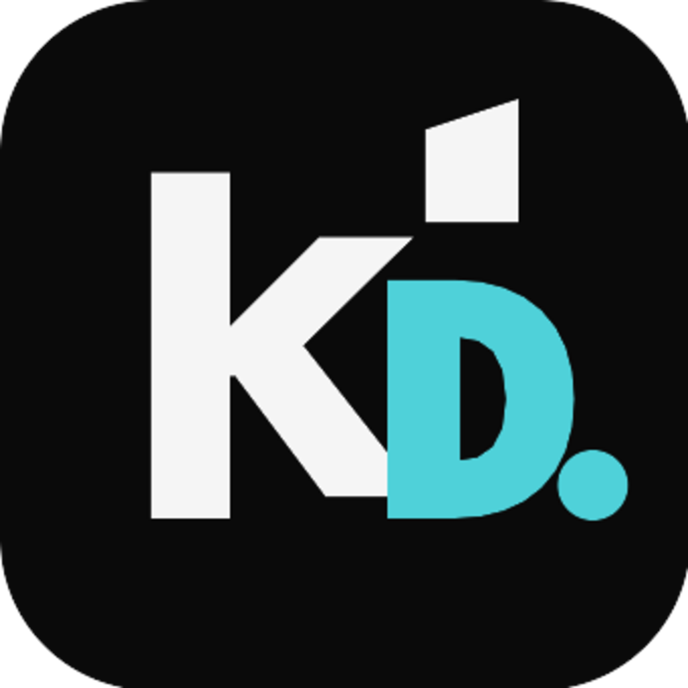

<p align="center">
  
</p>

<h1 align="center">KubeDeck</h1>
<p align="center">A desktop Kubernetes navigator — browse clusters and resources, run kubectl, and investigate problems with a built-in AI operator.</p>

<p align="center">
  <a href="https://github.com/swapnil-saal/kube-navigator/releases/latest">
    
  </a>
  
  
  
</p>

---

## Download

> **macOS Apple Silicon (arm64, macOS 13+)** and **Windows** (installer or portable)

👉 **[Download the latest release](https://github.com/swapnil-saal/kube-navigator/releases/latest)**

**macOS:** download the `.dmg`, drag **KubeDeck** to Applications, then right-click → **Open** on first launch (unsigned build).
**Windows:** run the NSIS installer, or use the portable `.exe`.

---

## Features

| Feature | Description |
|---|---|
| 🌐 **Multi-cluster** | Switch between all contexts in your `~/.kube/config` |
| 📦 **Resource types** | Pods, Deployments, Services, ConfigMaps, Secrets, Ingresses, StatefulSets, DaemonSets, Jobs, CronJobs, HPAs, PersistentVolumeClaims, and Nodes |
| 🔍 **Resource detail** | Full YAML view, metadata, labels, annotations, and status |
| 📋 **Pod logs** | Stream live logs directly from any pod container |
| 🤖 **AI operator** | Chat with an agent that has live, read-mostly kubectl access: it inspects the cluster, shows dashboards, and asks for your approval before any mutating command. Works with OpenAI, Anthropic, Ollama, or any OpenAI-compatible gateway |
| 🩺 **Cluster pulse** | Live health score and a list of what is broken right now (crashing pods, image-pull errors, degraded deployments, NotReady nodes), each one click from an AI diagnosis |
| 🔌 **Port forwarding** | Start, test, and stop `kubectl port-forward` sessions from the UI |
| ⌘K **kubectl palette** | Run kubectl or describe what you want in plain English |
| 🗂️ **Multiple kubeconfigs** | Point KubeDeck at several kubeconfig files in Settings |
| 💻 **Built-in terminal** | Full xterm.js terminal running your default shell |
| 🌙 **Dark / Light theme** | System-aware theme with manual toggle |
| ⚡ **Fast** | Electron + Vite + React, no cloud dependency — everything runs locally |

---

## Screenshots

> The app pulls real data from your local kubeconfig — no screenshots included to avoid leaking cluster info.

---

## Requirements

- macOS 13+ (Apple Silicon / arm64)
- `kubectl` installed and available in your PATH (e.g. via Homebrew: `brew install kubectl`)
- A valid `~/.kube/config` with at least one context

KubeDeck reads your full shell environment (including `KUBECONFIG` set in `.zshrc` / `.bashrc`) automatically.

---

## Tech Stack

- **Electron 40** — native desktop shell
- **React 18 + Vite** — frontend
- **Vercel AI SDK + assistant-ui** — the AI chat and agent
- **Express 5** — local API server (bundled inside the app)
- **xterm.js** — terminal emulator
- **Tailwind CSS + shadcn/ui** — UI components
- **kubectl CLI** — all K8s operations (shell out, no SDK dependency)

---

## Development

### Prerequisites

```bash
brew install node kubectl
```

### Setup

```bash
git clone https://github.com/swapnil-saal/kube-navigator.git
cd kube-navigator
npm install
```

### Run in dev mode

```bash
npm run electron:dev
```

This builds the Vite frontend + Express server bundle and launches Electron.

### Build installers

```bash
npm run package              # macOS: release/KubeDeck-<version>-arm64.dmg
npm run package:win          # Windows NSIS installer + portable (also built by CI on windows-latest)
```

> The build runs a deep ad-hoc re-sign (`codesign --deep --force --sign -`) after packaging to satisfy macOS 26.x Team ID enforcement.

---

## Project Structure

```
├── client/          # React frontend (Vite)
│   └── src/
│       ├── pages/   # Dashboard, ResourceDetail, Settings
│       ├── components/
│       └── ai/      # AI chat, cluster pulse and inline AI actions (import via "@/ai")
├── server/          # Express API server
│   ├── routes.ts    # kubectl-backed REST routes
│   ├── security.ts  # loopback / same-origin guard for the API and terminal
│   └── ai/          # providers, one-shot endpoints and the streaming agent (entry: registerAiRoutes)
├── electron/
│   └── main.cjs     # Electron main process
├── build/
│   ├── afterSign.cjs        # Post-sign hook for ad-hoc re-signing
│   ├── icon.icns            # macOS app icon
│   └── icon_source.png      # Source icon (1000×1000)
└── shared/          # Shared types/schema
```

---

## License

MIT © [Swapnil Saal](https://github.com/swapnil-saal)
